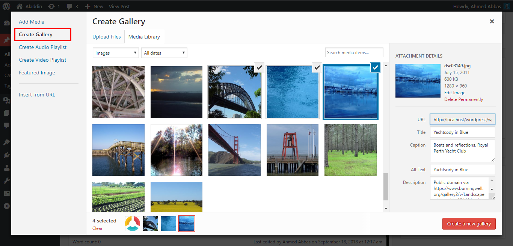

Aladdin
=======

Set-up & general guide to help you get the most out of your new
WordPress theme.

[Getting Started](#GettingStarted)
======================================================

This document covers the installation, set up, and use of this theme,
and provides answers and solutions to common problems. We encourage you
to first read this document thoroughly if you are experiencing any
difficulties before contacting our support team.

WordPress Upload
----------------

To upload through your Dashboard, select “Appearance” and then “Themes”.
Next, select the “Add New” tab at the top of the page and then select
the “Upload Theme” link, right above the search field. Choose your file
and select “Install Now”. Once the theme is fully uploaded and
installed, click “Activate” to activate the WordPress theme.

> The theme files will be stored on your server in the
> `wp-content/themes` location.

When uploading your theme with the installer, please ensure you are
uploading the theme .zip file, not the entire package you downloaded. In
this case, you will be uploading aladdin.zip.

FTP Upload
----------

To manually upload your new WordPress theme, login with your credentials
to your website and locate the wp-content folder in your WordPress
install files. Upload the **un-zipped** Aladdin folder into the:
wp-content/themes folder.

Once uploaded, activate the theme by heading to the “Themes” menu in the
WordPress Dashboard. Locate the Aladdin theme and hit “Activate”.

Import Demo Content
-------------------

Located inside the `/Demo Content` folder within the package contents,
you'll find a aladdin-export.xml file. This file contains the live
demo's Theme Content.

To import, first install and activate the [Wordpress
Importer](https://wordpress.org/plugins/wordpress-importer/) plugin,
which is available as a free download. After you're successfully running
the plugin, head to Tools and look for the Import section. find
Wordpress import system and click Run Importer

Import the `aladdin-export.xml` file with the uploader within that
section and hit "Upload file and import".

[Menus](#Navigation)
========================================

It is rather important to set your theme menu in the WordPress
Dashboard. To do this, locate the Menu options by selecting the
“Appearance” tab from the dashboard sidebar and then “Menus”.

Once you’re viewing the Menus, create a new menu and save it. After
you’ve saved the menu, you can add it to a menu via the Menu Settings,
below the Menu Structure area. Add your pages and links to the menu you
just created in the Menu Structure area.

Social Menu
-----------

The Social Menu is populated in both the site Header and sidebar
elements of the theme. To add the icons, simply create a custom link to
the social media location and input the Navigation Label as (facebook,
twitter, youtube, ...) and Aladdin will do the rest.

To also display the inputted social icons in the sidebar, simply check
the Sidebar Social Media Icons checkbox.

 

The following social media icons **are supported** (Type the Navigation
Label as below):

-   CodePen
-   Email
-   Facebook
-   Github
-   Google
-   Instagram
-   Linkedin
-   Pinterest
-   Twitter
-   Youtube

Featured Images
===============

Upload a featured image - any size will work. The images will be
automatically applied throughout all the neccessary templates and loops.

Gallery Post
------------

This is where you will a gallery post by clicking the Add Media button
then click Create gallery section. You have the capability to rearrange,
caption, choose images size and remove images from the popup modal that
appears.

Using the Widgets
=================

To employ a widget, simply go to your Widgets editor (located in your
WordPress Dashboard in the “Appearance” menu) and drag your widgets into
the specified widget areas.

[Customizer](#Customizer)
=============================================

To access the live Customizer, you may select the Customize button in
the admin bar dropdown or select `"Customize"` from the Dashboard menu.
Note that you must be logged in as a site administrator in order to
access the controls.

Theme Options
-------------

### 1. Site Identity

Set your site title, tagline, logo and the site icon.

### 2. Standard Colors

Here you can change the theme main colors.

### 3. header Image

heare you can add hedaer image

### 4. Background Image

Set your favourite background

### 5. Menus

Here you can create a new menu, add links to it set the menu location.

### Widgets

This will help you control the supported widgets in the site footer, you
can add a new widget or remove one.

[Plugins](#Plugins)
=======================================

To install any of our free plugins, simply download the plugin files.
Once you’ve successfully downloaded a zip file, head to your WordPress
Dashboard and select “Plugins \> Add New \> Upload.”

Add the zipped file in the field there and click “Upload.” Upon a
successful upload, you’ll be prompted to activate the plugin.

[Aladdin](@@demoUrl), a nice theme developed by [Ahmed Abbas](#)
